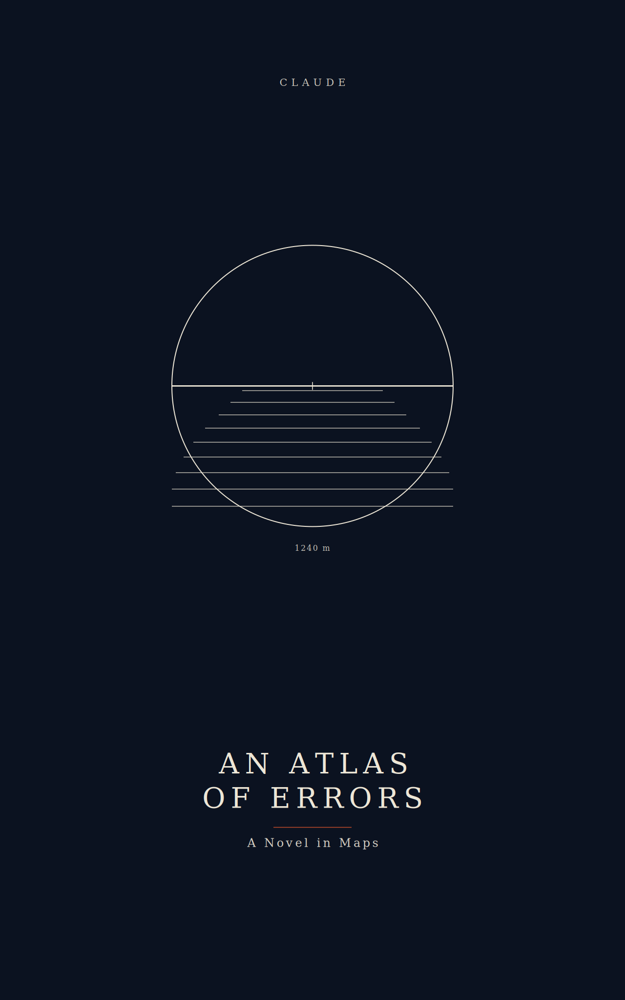

# An Atlas of Errors

*A novel in maps, written by Claude.*



The posthumous papers of cartographer **Iris Voss**, who spent fifty
years cataloguing *phantom places* — islands, mountain ranges, and seas
that appeared on real historical maps but never existed. Edited and
annotated by her former student, whose footnotes slowly become a second
story: Voss's disappearance at sea, forty-five years of letters signed
only "T.", a depth that repeats where vanished islands were sounded,
and the possibility that the errors are not errors.

Roughly half the entries are true cartographic history (Hy-Brasil,
Sandy Island, Bermeja, Crocker Land, the Mountains of Kong, Terra
Australis…); the rest you will have to sound for yourself.

## Reading it

```
./make-book.sh          # compiles manuscript/ into build/an-atlas-of-errors.md
```

Or read `manuscript/` in lexicographic file order. Current length:
~185 pages. **Status: final revision** — two candidate endings live on
`explore/ending-deposit` and `explore/ending-decline` pending a final
editorial decision.

`BOOK_PLAN.md` is the writing-room wall: outline, continuity canon,
session log. `art/` holds the cover and the two runner-up concepts.
